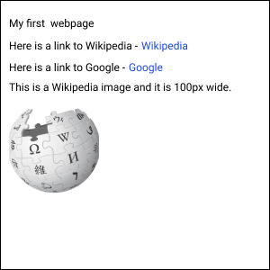

# HTML

HTML contains the contents of the webpage. It is a document that consists of many elements in a tree. All HTML documents start with the `html` element or tag. This tells the web browser that it needs to display an HTML webpage. All elements are written with brackets around them. They have an opening tag and a closing tag.&#x20;

`<html></html>`

Inside of the `html` element are all of the other elements that make up the document. The next level contains a `head` tag and `body` tag. Expanding our document tree, it now  looks like this:

```
<html>
  <head></head>
  <body></body>
</html>
```

### Head tag

The `head` tag contains information about the webpage that is not directly displayed in the browser window. An example of this is the `title` tag. The `title` tag does not show on the website but displays in the browser tab.

```
<html>
  <head>
    <title>My first webpage!</title>
  </head>
  <body></body>
</html>
```

### Body tag

The `body` tag contains the contents of the webpage. This includes all of the text, links, images and more.&#x20;

```
<html>
  <head>
    <title>My first webpage!</title>
  </head>
  <body>Hello. This is my first webpage</body>
</html>
```

### Block elements

Different elements display differently and have different behavior. Block elements take up the entire width of the page. A common block element is the `div`. Using `<div>` tags you can create new lines with text.

```
<html>
  <head>
    <title>My first webpage!</title>
  </head>
  <body>
    <div>Hello.</div>
    <div>This is my first webpage</div>
  </body>
</html>
```

### Inline elements

Inline elements only take up the width of the content they hold. A common inline element is the `span`. Using `<span>` tags you can keep your text on the same line.&#x20;

```
<html>
  <head>
    <title>My first webpage!</title>
  </head>
  <body>
    <span>Hello.</span>
    <span>This is my first webpage</span>
  </body>
</html>
```

### Links

Links are created using the `anchor` element. An `anchor` element is inline. Instead of typing `<anchor>` you just type `<a>`. To link to another webpage you use the `href` property of an `a` tag. We create properties by putting them inside the tag like this:

`<a href="https://wikipedia.org">Wikipedia</a>`

In the example above, the link will say 'Wikipedia' but will link to the webpage at https://wikipedia.org.

```
<html>
  <head>
    <title>My first webpage!</title>
  </head>
  <body>
    <a href="https://wikipedia.org">Wikipedia</a>
  </body>
</html>
```

### Images

Images are created using the `image` element. It is also an inline element and is written using the `` tag. To display an image you use the `src` property.&#x20;

`</img>`

```
<html>
  <head>
    <title>My first webpage!</title>
  </head>
  <body>
    </img>
  </body>
</html>
```

If you'd like to change the size of an image, you can set the `width` and/or `height` properties on the `image` element.&#x20;

`</img>`

## Exercise

For our first exercise, let's create a webpage that looks like the one below. Be sure to give your webpage a title!



### Extra Credit

Experiment with some more elements (`<strong>`, `<video>`, `<i>`)
